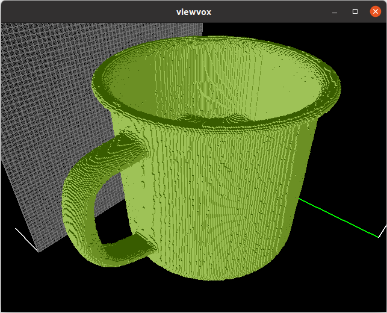
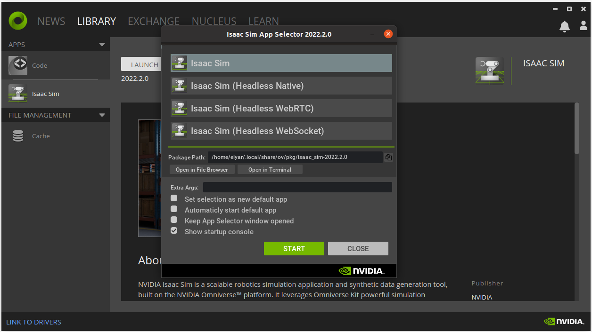

# object_shape_completion
This repository aims to train a neural network to complete the shape of objects using a single shot RGB-D image. The ultimate goal is to use the output of this network as input for another network, which will generate highly accurate grasp samples for grasping the objects.

## Downloading YCB data
The dataset_download_ycb.py file is created to download the dataset.
There are some options but for this repo the default options are applied to download the 3D models.
The files will be stored in model/ycb folder.

## Converting 3D models to [binvox][def] files
The ycb_binvox.py script converts downloaded models to .binvox files.
The converted files will be stored in corresponding folder inside models/binvox_files folder.

### Viewing binvox files
The created binvox files can be viewed by the [viewvox][def2] execution file. 
For example to view the binvox file models/binvox_files/025_mug/textured.binvox the following command should be run:

`./viewvox models/binvox_files/025_mug/textured.binvox `

And the result would be like the following image:

  

## Generating dataset in IsaacSim
Isaac Sim Replicator just accepts .usd files to import and synthesize data out of them. So we need to convert textured .obj objects to .usd files. The *asset_converter.py* file is written to convert those files. I have tried to explain details by comments inside this python script. The only thing which is very important is that this python scripts needs Isaac SDKs. One can either install Isaac SDKs or run this script from Isaac Omniverse api which already has Isaad SDKs installed.
To do it just install Nvidia Omniverse and also Isaac Sim, then Launch the Isaac Sim in Omniverse and in the next window select *"Open in Terminal"* as shown in the following image:

  

[def]: https://www.patrickmin.com/binvox/
[def2]: https://www.patrickmin.com/viewvox/
